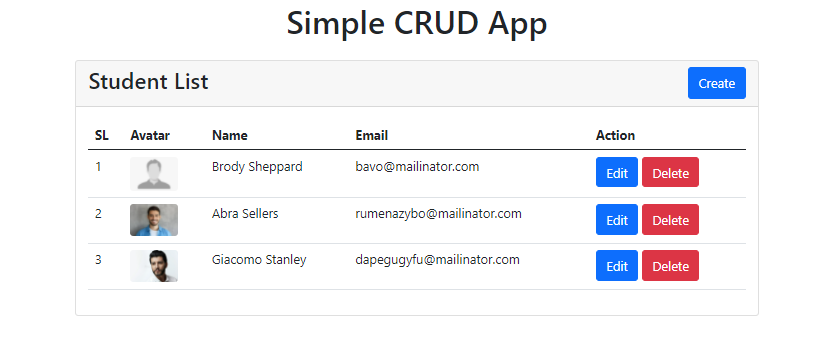
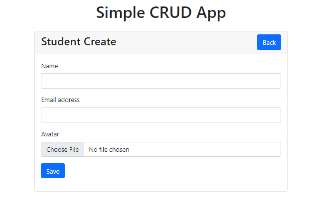

# Simple CRUD APP with Laravel Vuejs SPA

## Screenshot



## Build Setup

```bash

# Laravel dependencies
$ composer install

# create a .env file
$ cp .env.example .env

# generate application key
$ php artisan key:generate

# setup database credentails in the .env file

# migration the database
$ php artisan migrate --seed

# Serve the application
$ php artisan ser

# Vuejs dependencies
$ yarn install

# serve with hot reload at localhost:3000
$ yarn dev

# build for production and launch server
$ yarn build
$ yarn start

# generate static project
$ yarn generate
```
